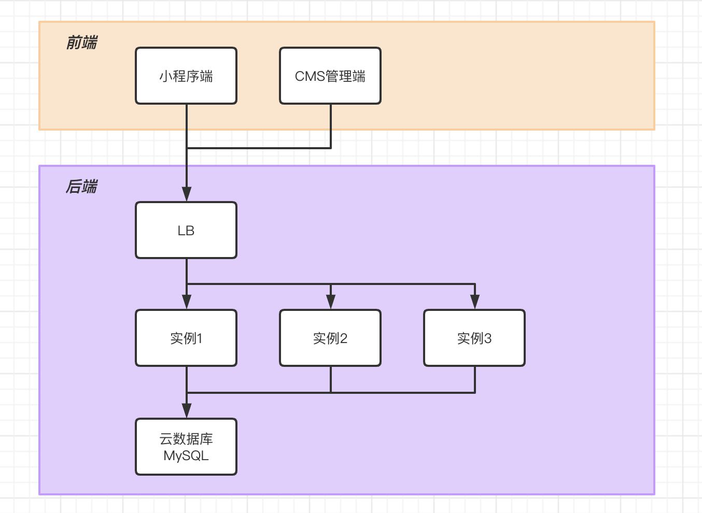
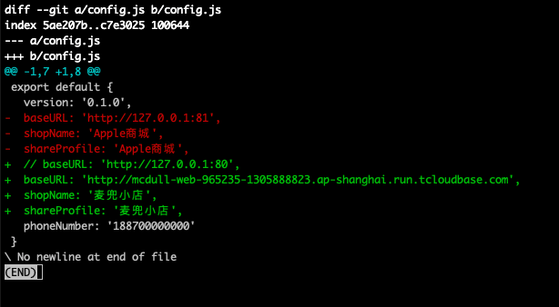

## 【云开发应用】麦兜小店-电商小程序

**麦兜小店** 电商小程序采用 **腾讯云托管** 的无服务器架构，使用 **云托管** 部署后端服务，提供标准的 RESTful API。

### 架构图

### 云托管后端服务

1. 拉取项目`master`分支最新代码。
2. 初始化数据库，要求是MySQL数据库，使用目录`docs/local/wechat_mall.sql`的脚本进行初始化。
3. 启动服务之前，需先定义服务配置 `conf/application.yaml`
4. 根目录的 `Dockerfile` 配置用于构建镜像，支持微信云托管流水线。
5. 获取腾讯云托管提供的公网域名地址。

### 构建小程序端

1. 拉取 [小程序端](https://github.com/ZuoFuhong/wechat-mall-miniapp) 代码，使用 **微信开发者工具** 打开。
2. 小程序端接入 **云托管-后端服务**, 只需要更换 **云托管的公网域名地址** 即可：

### License

This project is licensed under the [MIT license](./LICENSE).
